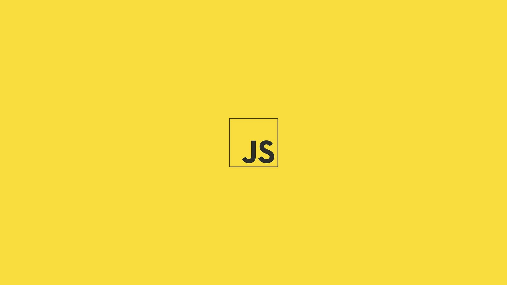

<h1 align="center"> Curso de JavaScript - B7Web </h1>

Curso exclusivo, promovido pela B7Web.

  <a href="## 🚀 Tecnologias">Tecnologias</a>&nbsp;&nbsp;&nbsp;|&nbsp;&nbsp;&nbsp;
  <a href="## 📋 Licença">Licença</a>

  

 

  

## 🚀 Tecnologias

Esse curso utilizou as seguintes tecnologias:

- JavaScript

## 📋 Licença

Esse projeto está sob a licença MIT.

---

Feito com ♥ by coutbiaafnts!
